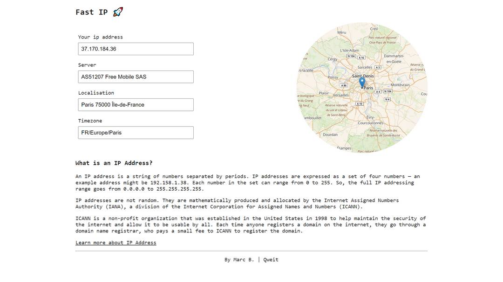

# Fast IP 🚀 | IP infos, nothing else.

## What about it?

I had trouble to find a website that just shows me my IP infos.
All i wanted to have was my IP Address and some basic informations like localisation, server...
Websites about IP Addresses are full of advertising, products to sell and other functionnality that i did not need.
  

## Stack

- Vite
- React
- react-leaflet

  

## API

- api.ipify.org
- ipinfo.io
    

## Features

A picture paints a thousand words
  

  
Feel free to fork the project and add features, the only thing i want is that the website keeps it simplicity.
